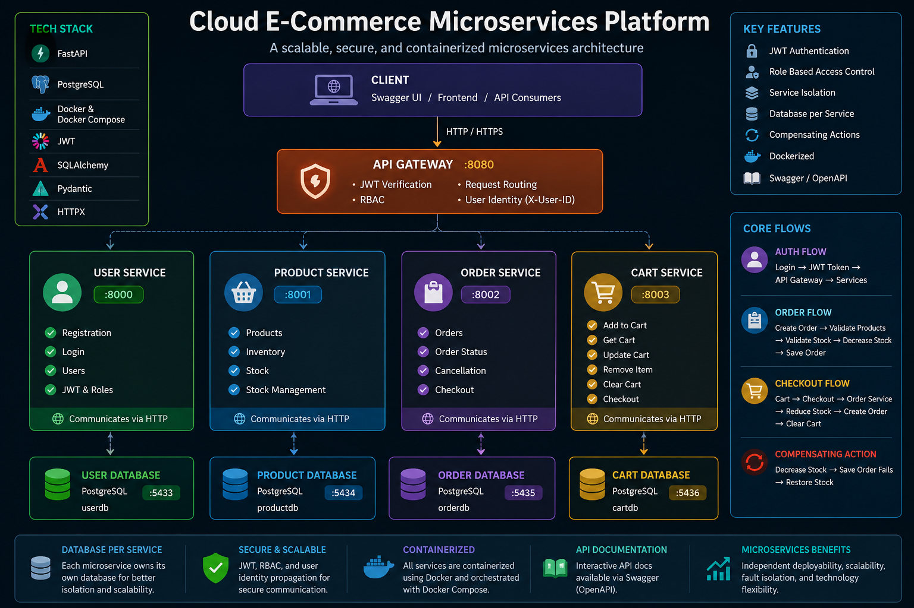

# Cloud E-Commerce Microservices Platform

A simple e-commerce backend built using FastAPI, Docker, PostgreSQL, JWT authentication, and a microservices architecture.

This project was built as a hands-on learning project to understand how different microservices communicate with each other while maintaining their own databases.

## Architecture



The project contains four main microservices:

- User Service
- Product Service
- Order Service
- Cart Service

All client requests go through the API Gateway.

Each service has its own PostgreSQL database.

## Services

| Service | Port | Purpose |
| --- | ---: | --- |
| API Gateway | 8080 | Routes requests and handles authentication |
| User Service | 8000 | Registration, login, users and roles |
| Product Service | 8001 | Product management and inventory |
| Order Service | 8002 | Orders and order status |
| Cart Service | 8003 | Shopping cart and checkout |

## Database

Each service has its own database:

- User Service → `userdb`
- Product Service → `productdb`
- Order Service → `orderdb`
- Cart Service → `cartdb`

This follows the database-per-service approach.

## Authentication

The application uses JWT authentication.

The basic flow is:

```text
User Login
    |
    v
User Service
    |
    v
JWT Token
    |
    v
API Gateway
    |
    v
Authenticated Request

The API Gateway gets the user ID from the JWT and passes it to the internal services using the X-User-ID header.

There are two roles:

Customer
Admin

Customers can manage their own account, cart and orders.

Admins can manage products and update order status.

Order Management

Orders use the following lifecycle:

pending
   |
   +----> confirmed ----> completed
   |
   +----> cancelled

The Order Service checks the product, checks stock, calculates the total price and creates the order.

Customers can cancel their own pending orders.

Admins can update order status.

Cart and Checkout

The Cart Service manages shopping cart items.

Adding an item to the cart does not reduce product stock.

Stock is reduced when checkout creates the order.

The checkout flow is:

Cart
  |
  v
Checkout
  |
  v
Order Service
  |
  v
Product Service
  |
  v
Stock updated
  |
  v
Order created
  |
  v
Cart cleared
Inventory and Failure Handling

The Product Service owns the inventory.

The Order Service communicates with the Product Service to reduce or restore stock.

The project also demonstrates a simple compensating action.

For example:

Reduce Stock
     |
     v
Create Order
     |
     v
If Order Fails
     |
     v
Restore Stock

This is a compensating action rather than a distributed database transaction.

Main API Endpoints
User Service
GET    /users
POST   /users
POST   /login
PUT    /users/{user_id}
DELETE /users/{user_id}

Product Service
GET    /products
POST   /products
PUT    /products/{product_id}
DELETE /products/{product_id}

Order Service
POST   /orders
GET    /orders
GET    /orders/{order_id}
POST   /orders/{order_id}/cancel
PUT    /orders/{order_id}/status

Cart Service
POST   /cart/items
GET    /cart
PUT    /cart/items/{product_id}
DELETE /cart/items/{product_id}
DELETE /cart
POST   /checkout


Technologies Used
Python
FastAPI
PostgreSQL
SQLAlchemy
HTTPX
JWT
Argon2
Docker
Docker Compose
Swagger / OpenAPI


Project Structure
cloud-ecommerce-microservices/
|
+-- README.md
+-- .env.example
+-- .gitignore
+-- docker-compose.yml
|
+-- docs/
|   +-- architecture.png
|
+-- api-gateway/
|
+-- services/
    |
    +-- user-service/
    +-- product-service/
    +-- order-service/
    +-- cart-service/


Environment Setup

Create your local environment file from the example:

Copy-Item .env.example .env

Then add your local configuration.

The real .env file is ignored by Git and should not be committed.

Running the Project

Start all services with:

docker compose up -d --build

Check the containers:

docker ps

Open the main Swagger documentation:

http://localhost:8080/docs

Other service documentation:

http://localhost:8000/docs
http://localhost:8001/docs
http://localhost:8002/docs
http://localhost:8003/docs


Future Work

Possible future improvements include:

React frontend
Kubernetes deployment
CI/CD with GitHub Actions
Monitoring with Prometheus and Grafana
Cloud deployment
Author

Dheeraj Kumar

Built as a hands-on project to learn microservices, Docker, APIs, authentication, databases and cloud-native application development.
